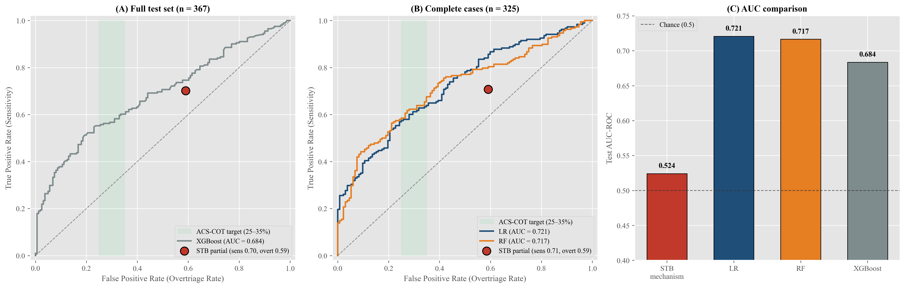
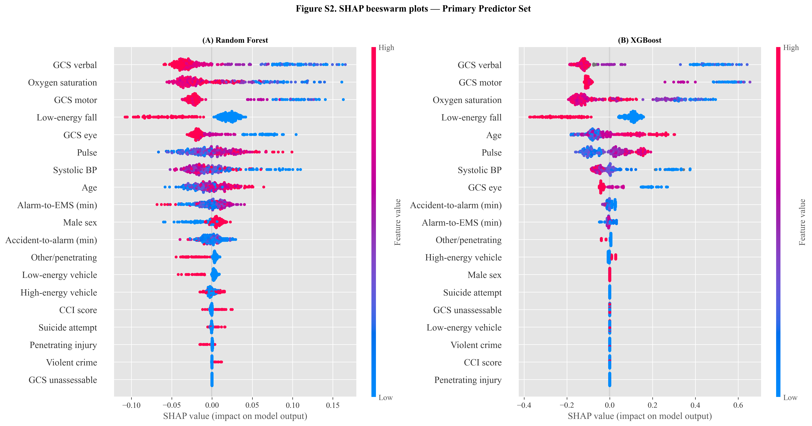

# Prehospital Prediction of Major Trauma (ISS ≥20) Using Machine Learning

*Can EMS-collected prehospital data improve trauma triage decisions in Switzerland?*

---

## Executive Summary

Trauma triage in Switzerland relies on rule-based guidelines to determine whether patients should be transported to specialized trauma centers. These rules are not calibrated on Swiss population data and may lead to both overtriage and undertriage.

This project evaluates whether machine learning models trained on routine prehospital EMS data can improve identification of patients with **major trauma (ISS ≥20)** compared to the current Swiss Trauma Board (STB) criteria.

Using data from **1,809 trauma patients (Luzerner Kantonsspital, 2016–2025)**, machine learning models consistently outperformed existing rule-based triage criteria and revealed structural limitations in predicting anatomical injury severity from field data alone.

---

## Key Findings





* Machine learning models achieved **moderate discrimination (AUC 0.66–0.72)** for predicting ISS ≥20
* All ML models outperformed the current Swiss Trauma Board triage rule (**AUC 0.524**)
* Overtriage remained high even at clinically optimized thresholds (**~82–89%**), highlighting a system-level tradeoff between safety and efficiency
* Patients with **ISS 16–19** showed significantly increased resource use and worse outcomes but were not identifiable using prehospital data
* The same predictors achieved **strong performance for mortality prediction (AUC 0.904)**, suggesting anatomical severity is harder to infer than physiological deterioration
* Simpler models (logistic regression, random forest) performed comparably to gradient boosting

---

## Clinical Interpretation

* Current EMS triage rules may not reflect Swiss-specific injury patterns or resource utilization
* Prehospital physiological data has **limited ability to distinguish anatomical injury severity**
* The ISS ≥20 threshold may miss a clinically important intermediate-risk group (ISS 16–19)
* Machine learning is better suited for **decision support augmentation**, not autonomous triage

---

## Why this matters

This work has direct implications for:

* **EMS decision support systems** (real-time triage assistance)
* **Swiss trauma system policy** (evaluation of ISS ≥20 threshold)
* **Resource allocation** in trauma centers
* **Design of prehospital digital tools** integrating predictive risk scoring

Rather than replacing clinical judgment, models could function as **decision-support tools** to improve triage consistency and highlight borderline high-risk cases.

---

## Methods Overview

* Dataset: 1,809 trauma patients (Swiss Trauma Registry contribution)
* Outcome: ISS ≥20 (major trauma definition)
* Models: Logistic Regression, Random Forest, XGBoost
* Validation: 80/20 stratified split with 5-fold cross-validation
* Missing data: Multiple Imputation by Chained Equations (MICE)
* Evaluation: AUC, Brier score, sensitivity/specificity, overtriage/undertriage analysis
* Explainability: SHAP values + coefficient interpretation

---

## Repository Structure

```
prehospital-trauma-ml/
├── README.md
├── requirements.txt
├── notebooks/
│   ├── 01_data_preparation.ipynb
│   └── 02_model_development.ipynb
├── reference/
│   ├── category_mapping.xlsx
│   └── translation_mapping.xlsx
├── figures/
│   ├── cohort_flowchart.png
│   ├── feature_importance.png
│   ├── roc_curve.png
│   └── shap_beeswarm.png
├── supplementary/
│   ├── table_1_baseline.docx
│   ├── table_2_model_performance.docx
│   ├── table_3_sensitivity.docx
│   ├── table_4_iss_groups.docx
│   └── table_5_subgroup.docx
└── .gitignore
    
```

---

## Reproducibility

All preprocessing, modeling, and evaluation steps are fully reproducible using the provided notebooks.

> Note: Patient-level data is not included due to institutional privacy restrictions. Code is designed to run on equivalent structured EMS datasets.

---

## Limitations

* Single-center retrospective dataset (no external validation)
* ISS is a post-hoc anatomical outcome not directly observable in real time
* Some comparator features from STB criteria were approximated due to data structure limitations
* Subgroup analyses (e.g., dispatch level) have small sample sizes

---

## Future Work

* External validation using Swiss Trauma Registry data
* Prospective evaluation in EMS workflow
* Alternative outcomes (mortality, emergency surgery) for deployment-ready prediction
* Integration with dispatch and transport optimization systems
